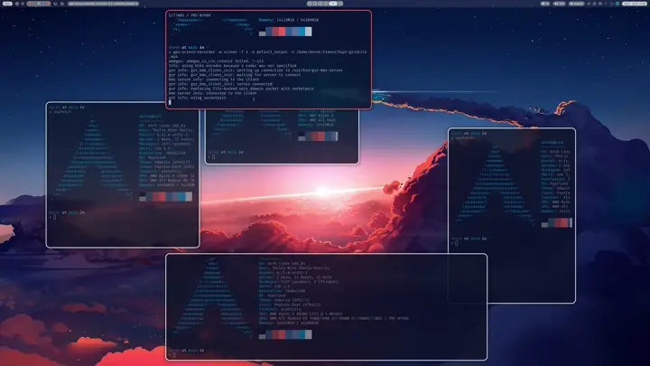

hypr-gridtile
=============


Have you caught the Hyprland bug? Well then I have an additional gimmick for you!



This is a useful little utility which tiles floating windows. Yes, that sounds
just as wrong to me as it does to you.

Imagine you have a big screen, and a window that you don't want fullscreen, but
you also don't want to add padding windows (extra terms, etc...) to make fit
nicely. This allows you to quickly resize and place a floating window without
grabbing for your mouse and trying to click the correct edge, grab it, and
drag it around until it's the right size, only to have to then move the window
around and resize again because you didn't guess right the first time, GOTO 10.

Also, for laughs, this package includes a transparent blank window app called
`hypr-bufferwin`, which is resizable, see-through, and useful if you want to
add padding to your desktop so that you don't have a single huge window
covering your whole desktop. Use it or not, it's not the main point of the
`hypr-gridtile` package.

Installation
------------

Copy binaries to your `$HOME/.local/bin/` folder and then add this little 
snippet to your hypr keybindings:

```
bind = $mainMod CTRL, T, exec, /home/derek/.local/bin/hypr-gridtile # TILE!
```

and optionally also:

```
bind = $mainMod ALT, B, exec, ~/.local/bin/hypr-bufferwin # Spacer window launch
```

Configuration
-------------

The config file lives at `$HOME/.config/hypr-gridtile/hypr-gridtile.ron` and is
in [RON](https://github.com/ron-rs/ron) notation. Fields should be fairly
self-explanatory. Note that, at this time, only a TOP waybar is supported. I'll
be adding support for bottom waybars via negative waybar-height values.

Status
------

Currently, this little project has had a grand total of MAYBE 4 hours of work,
so it's missing a ton of features that I'm gonna backfill over the next few days:

 1. ~Persistent configuration. It will remember how many rows and columns your
    favourite grid has.~ DONE!
    1. ~I might even add customization to allow alternate keyboard layouts, if
       anybody ever actually requests it.~ DONE! This turned out to be a 
       doddle, so I just hacked it in there.
 2. Custom theming. We're using Hyprland, it's kinda the whole point. I'll 
    be figuring out how to grab the stylesheets and apply a matching style
    to the egui window.
 3. Retries. Some apps behave weird on resize, and end up only making it part
    way to the desired location. I want to keep trying because it usually
    can be forced to converge. Kinda-done; I just try twice by default.
 4. ~hypr-bufferwin -> I'll add a dummy transparent window app that can be
    used for those times when you DO want full tiling, but have a space you
    want empty to move the window over a bit. When you have a 43" monitor,
    sometimes a full width window is a bit... much. I hate moving my head back
    and forth to read like some ludicrous cartoon character.~ Done.
